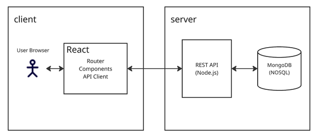

# Project Proposal: Habit Tracker

### Tech Stack

- Frontend  
  - React: for building web application and UI \- everything user will directly interact with  
  - Axios: sending API requests from frontend  
  - Static images and HTML  
- Backend  
  - Node.js: handling API requests and sending or receiving data  
- Database  
  - MongoDB Atlas: NoSQL database to store per-user information  
- Hosting  
  - Vercel: hosting and deploying frontend

### Stack Focus

The project will be handling information from individual users, which is best stored in a document database which users interact with through a React interface and REST API. It will primarily be a website, though it could be ported to mobile further down the line. For compatibility, the focus will be on common modern browsers.

### Project Goal

The end goal of the project is to create a habit-tracking web application that is easy to use for users who want to build up new habits while maintaining a positive experience by prioritizing frequency over consecutive-day-streaks. The UI should be clean and easy to understand without being either oversimplified or convoluted and the overall tone of the app should be gentle and encouraging.

### User Demographic

- Teenagers: younger people who have started thinking about forming or getting rid of long-term habits  
- Adults: people with long-term goals and would like to track activity over time  
- People who struggle with motivation

### Data and API

- Data: each user’s login information, individual habit information, and overall habit progress  
  - Database schema will likely consist of a list of habits per user, each with a name, description, difficulty, etc.  
- API: will need to create own REST API to create, read, update, and delete information from the database  
- Potential issues:   
  - losing connection to database; possible trouble on the server side due to hosting platform being down  
  - protection against hacking; may add CAPTCHAs and other security for creating accounts (not in scope)  
  - user data security; can configure Vercel to use HTTPS to protect user information (in scope)

### Functionality

- Homepage: Brief description, login and sign up options  
- Editing habits page: Once logged in, user can create, delete, and update habit items  
- Listing habits page: User can see their list of habits and their frequency over the past month or week through charts or diagrams  
- Reward system:   
  - Every time habit is checked off on website, a randomized popup of encouraging words or image will show as a reward  
  - User’s background reef gains more animals as user achieves their goals; resets weekly/monthly based on user preference

